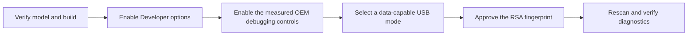

# OEM Setup Guides

OEM matching uses authorized-device manufacturer, brand, model and measured skin properties. If
those fields are absent, no OEM is guessed and the OEM action remains disabled.

| Catalog key | Manufacturer family | Covered setup details | Official starting point |
|---|---|---|---|
| `samsung` | Samsung | Developer options, USB debugging, USB restrictions, Knox, Game Booster | <https://developer.samsung.com/android-usb-driver> |
| `google` | Google Pixel | Developer options, USB/Wireless debugging, USB Preferences | <https://developer.android.com/studio/debug/dev-options> |
| `xiaomi` | Xiaomi, Redmi, POCO | Security debugging, Install via USB, default mode, MIUI/HyperOS | <https://developer.android.com/studio/debug/dev-options> |
| `huawei` | Huawei | HDB, HiSuite, EMUI/HarmonyOS authorization | <https://consumer.huawei.com/support/> |
| `honor` | Honor | MagicOS debugging and authorization | <https://www.honor.com/support/> |
| `oneplus` | OnePlus | OxygenOS debugging and power controls | <https://service.oneplus.com/> |
| `oppo` | OPPO | ColorOS permission monitoring and restrictions | <https://support.oppo.com/> |
| `realme` | Realme | Realme UI permission/power controls | <https://www.realme.com/support> |
| `vivo` | Vivo | Developer mode, authorization, power management | <https://www.vivo.com/en/support> |
| `motorola` | Motorola | Developer options and Motorola driver support | <https://en-us.support.motorola.com/> |
| `sony` | Sony Xperia | Developer options and Sony developer support | <https://developer.sony.com/> |
| `nokia` | Nokia / HMD | Standard Android debugging and HMD support | <https://www.hmd.com/support> |
| `asus` | ASUS / ROG / Zenfone | Debugging, performance and driver support | <https://www.asus.com/support/> |
| `nothing` | Nothing | Nothing OS debugging/support | <https://support.nothing.tech/> |
| `lenovo` | Lenovo | Developer options and Lenovo drivers | <https://support.lenovo.com/> |
| `zte` | ZTE / Nubia | Developer options and ZTE support | <https://support.ztedevices.com/> |
| `meizu` | Meizu / Flyme | Flyme developer/security settings | <https://www.meizu.com/en/support> |
| `transsion` | Tecno / Infinix / itel | OEM developer and power controls | <https://www.tecno-mobile.com/support/> |
| `other` | Other verified manufacturer | Standard Android steps without OEM assumptions | <https://developer.android.com/studio/debug/dev-options> |

Every in-app guide includes ordered steps, an estimated completion time, OEM notes and an HTTPS
official-documentation action. Menu names can vary by software build, so users are instructed to
verify the detected model/build rather than follow an assumed layout.
