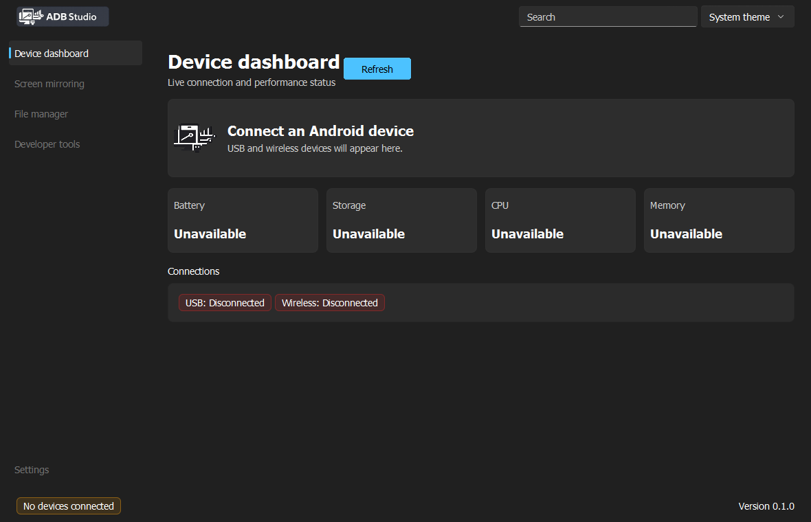
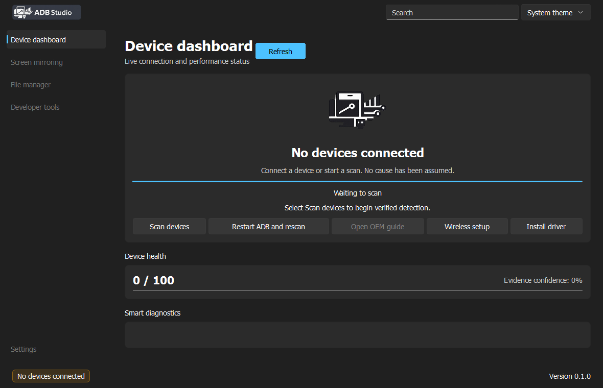
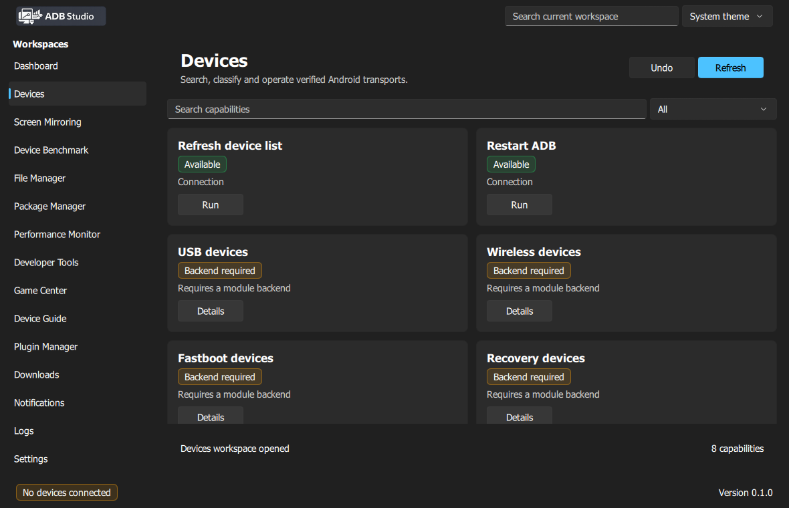
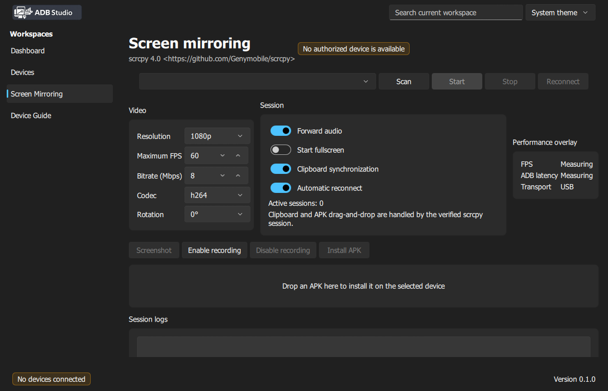
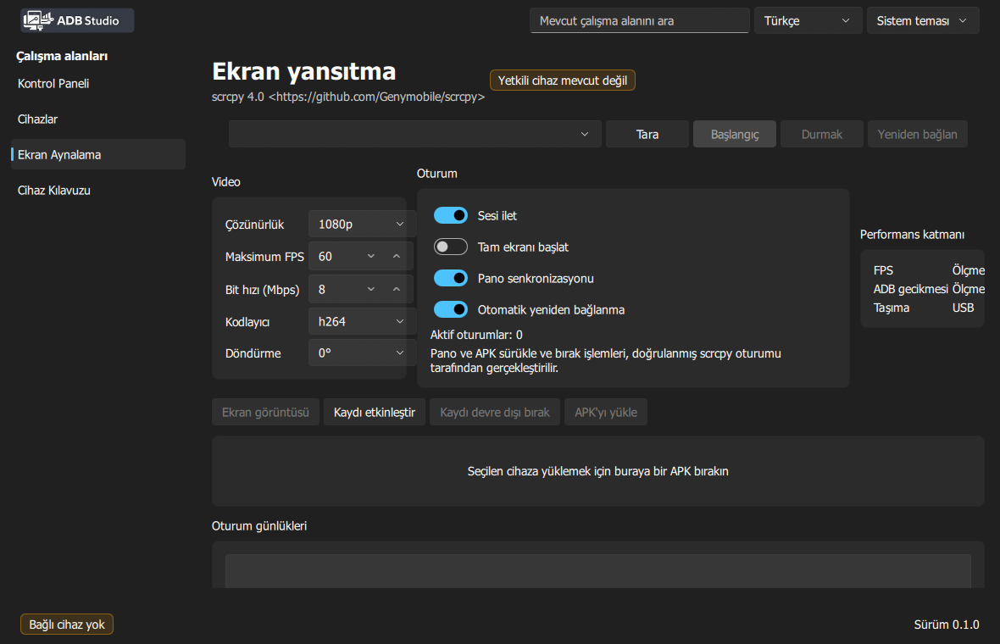

# ADB Studio


ADB Studio is a Windows-first, cross-platform-ready Android device management application built
with C++20, Qt 6.8, Qt Quick, QML and the FluentWinUI3 Qt Quick Controls style.

The `0.1.0` release provides the governed repository foundation, FluentWinUI3 shell,
evidence-based device onboarding and a real scrcpy 4.0 mirroring vertical slice. The visible modules
are Dashboard, Devices, Screen Mirroring and Device Guide; unsupported modules are not shown.
Mirroring supports per-serial USB/wireless sessions, audio, recording, screenshots, clipboard
options, APK installation, display/codec controls, metrics and recovery. English and Turkish switch
live without restarting.

## Build

Prerequisites are Visual Studio 2022, CMake 3.25+, Python 3 and Qt 6.8.1 MSVC x64.

`build.py` is the single local and CI entry point. For a complete unsigned local package set, run:

```powershell
python build.py package
```

The release output is `dist/ADB-Studio/adb-studio.exe`. The command runs repository validation,
CMake, tests, `windeployqt`, packaging, SBOM creation, checksums, manifest generation and startup
benchmarking. It verifies the Qt runtime, Windows platform plugin and FluentWinUI3 plugin.

Supported commands are `configure`, `clean`, `build`, `rebuild`, `test`, `benchmark`, `lint`,
`package`, `sign`, `release`, `publish` and `nightly`. Select Debug with, for example,
`python build.py build --config Debug`.

Release builds generate a portable ZIP, Inno Setup installer, MSIX, debug-symbol ZIP, license
bundle, SPDX/CycloneDX SBOMs, SHA-256 file and artifact manifest under `dist/artifacts` and
`dist/evidence`. Set `ISCC` only when Inno Setup is installed in a non-standard location.

Production `release`, `publish` and `nightly` operations require Authenticode credentials and fail
closed when any credential or verification step is missing. Secrets are read only from
`SIGN_CERT_PATH`, `SIGN_CERT_PASSWORD`, `SIGN_TIMESTAMP_URL` and `SIGN_HASH_ALGORITHM`.
`MSIX_PUBLISHER` must match the signing certificate subject. Only basenames allow-listed in
`config/first-party-binaries.txt` are signed; deployed Qt and MSVC files are never signed.

```powershell
cmake --preset windows-msvc-debug
cmake --build --preset windows-msvc-debug
ctest --preset windows-msvc-debug -C Debug
```

Update and validate resources after QML changes:

```powershell
python scripts/update_resources.py .
python scripts/validate_resources.py .
python scripts/validate_qml_policy.py .
```

See `CONTRIBUTING.md`, `GOVERNANCE.md`, and `docs/architecture/README.md` before changing code.
Connection behavior is documented in `DEVICE_DETECTION.md`, `CONNECTION_WIZARD.md`,
`SMART_DIAGNOSTICS.md`, `OEM_GUIDES.md`, `USB_RECOVERY.md`, `WIRELESS_SETUP.md` and
`DEVICE_HEALTH_SCORE.md`.
Sidebar architecture and capability availability are documented in
`docs/modules/sidebar-workspaces.md`; the real mirroring slice is documented in
`docs/modules/screen-mirroring.md`.

## Current UI










