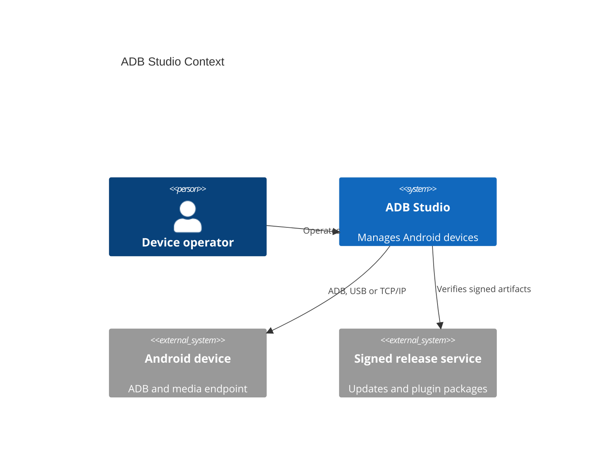
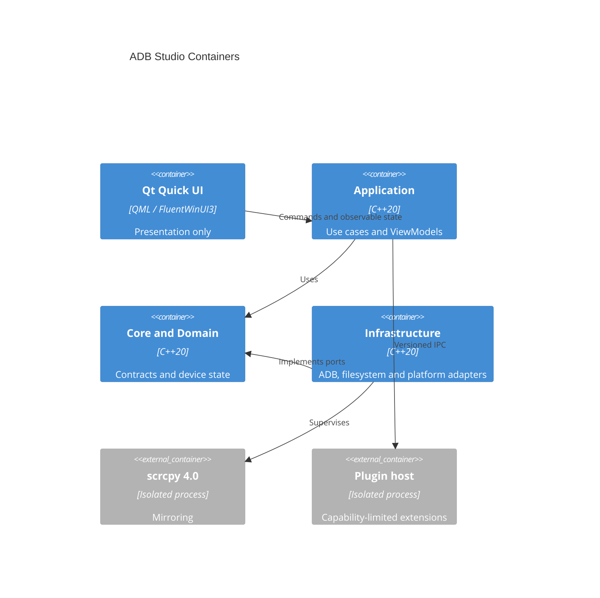
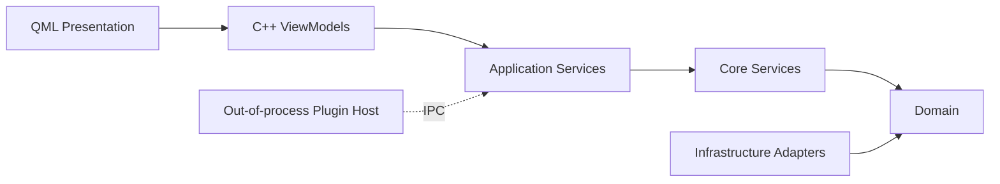
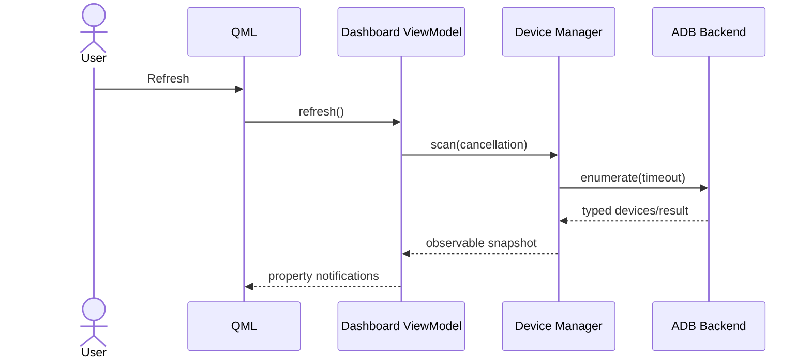
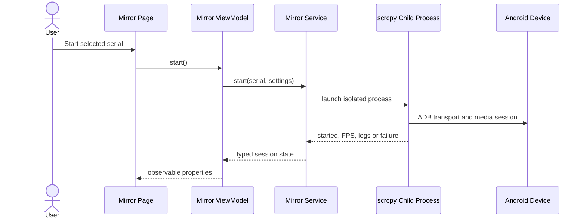
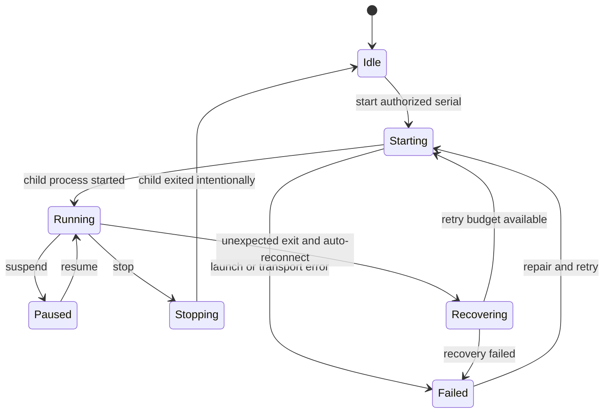
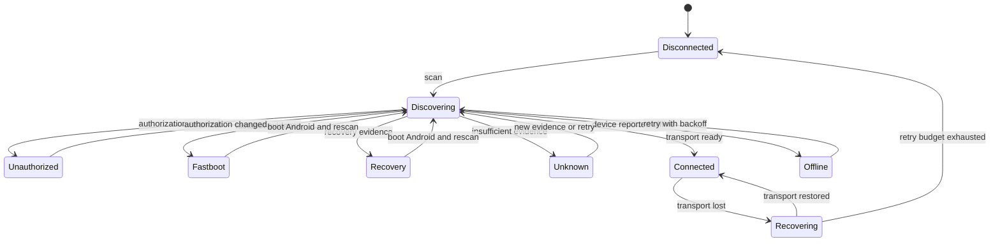

# Architecture

ADB Studio enforces this dependency direction:

`Presentation -> ViewModel -> Application -> Core -> Domain <- Infrastructure`

Infrastructure implements domain-facing interfaces and is composed at the application boundary.
QML imports presentation types only. Plugins run outside the application process. See ADR-0001,
ADR-0002, ADR-0003, ADR-0004, ADR-0005 and
the diagrams in this directory before changing dependencies.

## Diagrams













```mermaid
sequenceDiagram
  participant QML as Connection Wizard
  participant VM as Dashboard ViewModel
  participant Worker as Worker Thread
  participant Probe as ADB/Fastboot/PnP Probe
  participant Engine as Diagnostics Engine
  QML->>VM: refresh()
  VM->>Worker: probeWithRecovery()
  Worker->>Probe: measure facts
  alt transport failed and recovery is safe
    Probe->>Probe: refresh PnP; restart ADB
    Probe->>Probe: measure facts again
  end
  Worker->>Engine: analyze(tri-state facts)
  Engine-->>VM: immutable report
  VM-->>QML: observable, localized state
```



## Module Dependency Matrix

| Consumer | Presentation | ViewModel | Application | Core | Domain | Infrastructure |
|---|---:|---:|---:|---:|---:|---:|
| Presentation | allowed | allowed | denied | denied | denied | denied |
| ViewModel | denied | allowed | allowed | denied | denied | denied |
| Application | denied | denied | allowed | allowed | allowed | denied |
| Core | denied | denied | denied | allowed | allowed | denied |
| Domain | denied | denied | denied | denied | allowed | denied |
| Infrastructure | denied | denied | denied | allowed | allowed | allowed |

`module-dependencies.json` is the reviewed machine-readable dependency policy and mirrors CMake
target metadata. CI rejects cycles, unknown modules and matrix violations.

Current concrete dependency path:

`Fluent QML -> MirrorViewModel -> MirrorService -> QProcess -> scrcpy/ADB -> Android device`
